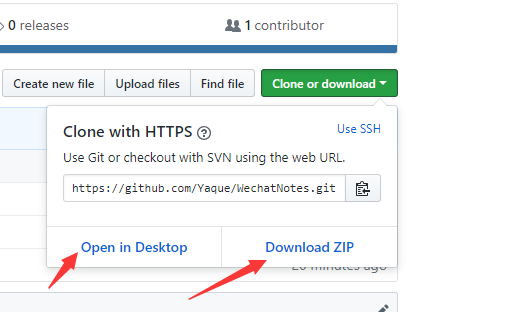
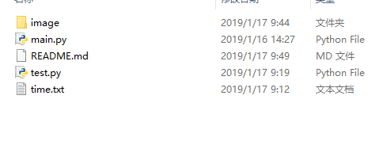
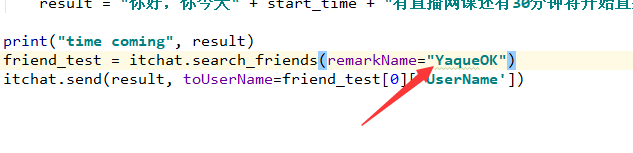
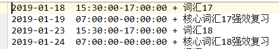
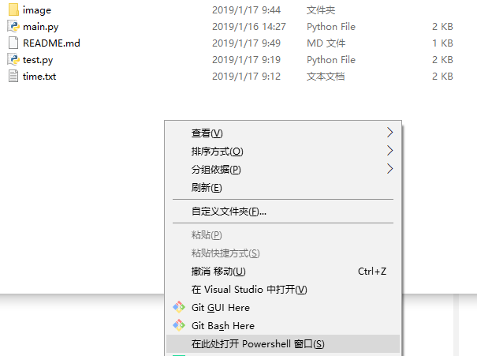
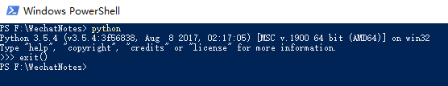
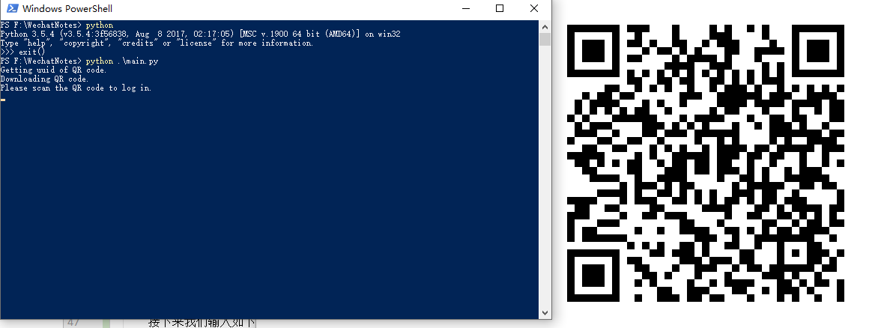
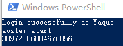

# WechatNotes
微信，自动提醒

***
## 一、快速运行
1. 安装环境

    [python3](https://www.python.org/)、
    [itchat](https://github.com/littlecodersh/ItChat)
    
    注意：可在任何能够安装上述两个环境的系统中运行。
2. git clone项目

    + 在命令行中安装git后执行如下操作。

            git clone https://github.com/Yaque/WechatNotes.git

    + 直接[点击](https://github.com/Yaque/WechatNotes/archive/master.zip)此处下载
    
    + 或者点击下图中的**clone or download**
    
         
         
3. 运行

    + 下载完成后，本地目录如下图
    
        
        
    + 简单修改为自己可用的
    
        用记事本或其他编辑工具打开**main.py**，找到下图所示位置，将**YaqueOK**更改为
        你自己微信号的好友中的那个人的备注的名字。
        
        
        
        修改完成之后关闭这个，打开time.txt修改时间表，对应下图中的样式修改，最后空格后
        的为提示信息。建议修改一个立即到达的时间用于测试。
        
        **注意**：本提示是提前30分钟发送的，所以开始时间一定要距离现在时间还有30分钟以上，
        才能正常测试。
        
        
    
    + Windows10 平台运行
    
        ① 打开shell。
        
        按住键盘上的**shift**键同时单机右键，这个按键在键盘上有两个，选其中之一即可。
        结果将如下图所示。选择图中最后一项**在此处打开Powershell窗口**
        
         
         
         从图中可以看到，我把从github下载的文件放在了F盘下面。
         
        ② 开始运行
        
        成功打开会出现如下图所示页面。
        
        
        
        接下来我们输入如下命令,没输入一条按一下enter键。
        
            python
            exit()
        
        如果你的电脑只安装了python3的一个版本，则会出现如下图所示状态。
        
        
        
        从图中可以看到我得python版本为3.5.4。
        
        接下来我们输入如下命令。
        
            python ./main.py
            
        按完enter键之后将会出现如下图所示状态。
        
        
        
        图中可以看到二维码，我们接下来拿手机微信，扫描图片中的二维码像登录网页版微信一样
        即可。扫描完之后回出现如下界面。
        
        
        
        接下来等待你设置的时间点的到来。

***
##二、联系我

1. 邮箱

    yaquepeng@outlook.com
    
***
+ 声明：

    不喜勿喷，写这么啰嗦纯粹为了学习Markdown
